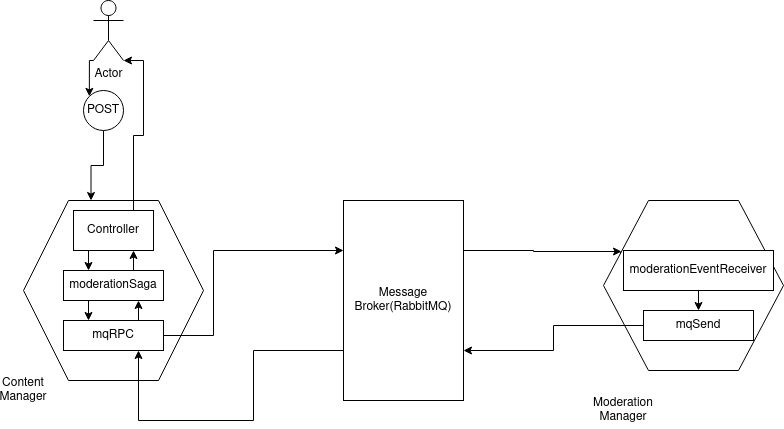

# Software architecture project report.
 - Assignment type B
 - Author: Vili Lipo
## Introduction

In this project I set out to demonstrate micro-service design patterns in
practice. My primary focus was on the Saga-pattern, but to facilitate that I
needed to implement some other patterns as well, like database-per-service and
API-gateway. To demonstrate these patterns I built a walking skeleton of a
discussion forum application named Jaffa, which stands for just a fun forum
application. 

I also was curious to see how using machine queues could work in the
inter-service communications in my application, so I decided to use RabbitMQ to
deliver the messages in my Saga. Using machine queues in event transmission has
certain benefits, like decoupling the micro-services from exact addresses as
they can just send their messages to the right queue and let the message broker
to do the rest.

The goal of the architecture in this project is to allow easy extensibility and
scalability for the platform.

First in this report I introduce the Saga pattern, then I go through
architecture of the Jaffa-application. In the third part I explain the
implemented Saga-pattern in  detail. In the fourth part is the instructions for
running the demonstration.

### Saga

In a context where the database per service pattern is implemented, it can 
be challenging doing transactions that span multiple services. Saga pattern
is created to do ACID-transactions between services.

Chris Richardson defines Sagas in two categories: choreography based
and orchestration based on his site(www.micro-services.io). In choreograhy-based
each local transaction publishes domain events that trigger local transactions
in other services. In orchestration-based saga an orchestrator tells the
participants what local transactions to execute.

## Architecture overview of Jaffa

Jaffa consists of three micro-services and a single-page-application frontend.
The micro-services are all implemented using `Node.js`, the
object-relation-mapping-library-`Sequelize.js` and `Express.js`.  The two core
domain services, `Content Manager` and `Moderation Manager` use `amqplib` to
communicate the saga messages between each other. Finally, there is the
API-gateway, that is also responsible for authentication and user management.
The front-end uses `React.js`.

### The Content Manager

The content manager is the core of the Jaffa domain actions. It is responsible
for CRUD-functionality of the forum posts and comments.  Only the
create-functionality and read-functionality are implemented in the walking
skeleton. It does not perform any complex checks to the content as that is the
job of the moderation manager.

### The Moderation Manager

The moderation manager is responsible for automatically moderating the forum contents.
It denies the posts, and comments from muted users and the posts that otherwise
violate some rules. It also provides the API:s for muting and unmuting users.

The saga pattern resides between these two services in the Jaffa-architecture.

## The Saga pattern experimentation


### Possible Sagas in Jaffa domain.
In the choreography based saga the multiple services communicate their transactions
through distinct event channels. In the case of Jaffa the choreography-based saga
would be the following, the API-gateway is omitted for the sake of simplicity:
 - 1. The  Content Manager receives `POST /api/content` and it creates a 
 `Post` with the `Pending` field set to `true`.
 - 2. Then it emits `Post Created` event
 - 3. The `Moderation Manager`s   event handler checks the post
 - 4. It emits an event indicating the outcome
 - 5. The `Content Manager`s event handler approves or rejects the `Post`

In orchestration there is an artefact that controls the saga. In the 
case of Jaffa it is the Content-Controller.
Now the orchestration-based saga in the Jaffa-context is the following:
 - 1. The  Content Manager receives `POST /api/content` and it creates a `Post`
   with the `Pending` field set to `true`.
- 2. The `Moderation Saga` is called
- 3. The `Moderation Saga` sends `Moderation` command to the `Moderation Manager`
- 4. The `Moderation Manager` checks the post.
- 5. It sends back a reply message indicating the outcome.
- 6. The saga orchestrator, in this case the controller for the post route,
  approves or rejects the `Post`.

Diagram of  the orchestration based Saga.



### My experience in implementing the Saga

 At first, I tried to implement the choreography based Saga, as it seems very
 straight forward and it does not have many artefacts at all. One issue
 emerged, which nudged me towards orchestration-based saga, and that was
 communicating the result of the saga to the client who did the initial `POST
 /api/content`.  It was nearly impossible to reach the client that started the
 saga in the HTTP-controller from the machine queue event-listener, because in
 my architecture the part that listened to HTTP and the AMQP-queue were highly
 decoupled. So to return the result of the saga, I needed orchestration in
 the controller responsible for reacting to the HTTP post request in the
 Content Manager-service.

With the orchestration-based saga
the key difference for my application was that the message from the Moderation
Manager is a direct reply to the moderation command and not just two loosely
coupled events. This meant that I could wrap the event listener action in the
interservice part of my Content manager to a `Promise` that allows the service
to wait for the reply in the controller. This is how the HTTP events and the
AMQP-events could be coupled in a neat stateless fashion.

Now the whole Saga could be finished
before the reply is sent back to the client. This is very important for the
usability of the application, as descriptive feedback can be given directly to
the user if the content he/she sends does not pass moderation.

In retrospect, it is easy to see that I was clearly wrong in choosing the
choreography-based saga at first, because the Content Manager was always meant
to tell the Moderation manager exactly what local transaction to execute.

There might have been a third way of coupling the actions together, using the
`Sequelize`-library's hook functionality, that allows  functions,
like the AMQP-rpc wrapper I wrote, to be called when a Post is created to
the database.  This would be most like the `Event Sourcing` pattern that
Richardson also promotes on his site. This would have the benefit that a
developer could never forget to send the moderation event to the moderation
service, when a post is created at any position in the source code of the
content manager.

Also, if the clients are able to listen to events in some ways like using
machine queue channels or web sockets, choreography based Sagas can be used
in a less cumbersome way, than replying the results with http.

In this project I spent most of the time trying to fit two libraries with very
different styles together, them being `Express.js` and `amqplib`.  That was of
course time removed from studying the Saga-pattern, but it is a good lesson in
software architecture nevertheless. The key takeaway being here that choosing
frameworks that play well together can be more beneficial than just selecting a
collection of frameworks that are good at doing the one thing they do.

### Code snippets

The Saga begins in the Content-manager in the file `/controllers/content.js`

```javascript
const contentRouter = require('express').Router();
const Post = require('../models/post.js');
const Comment = require('../models/comment.js');
const moderationSaga = require('../interservice/moderationsaga.js');

// some code is cut out

contentRouter.post('/', async (request, response) => {
  try {
    const data = request.body;
    const { username, title, content } = data;
    const newPost = await Post.create({ user: username, title, content });
    const jsonData = newPost.getJsonRepresentation();
    const moderationresult = await moderationSaga(jsonData); // this starts the saga
    if (moderationresult) {
      const [postAfterModeration] = await Post.findAll({
        include: [Comment],
        where: { id: newPost.id },
      });
      console.log('Saga passed');
      response.status(200).json(postAfterModeration);
    } else {
      console.log('Saga did not pass');
      response.status(401).json({ error: 'Post did not pass automatic modaration' });
    }
  } catch (error) {
    console.error(error);
    response.status(500).json({ status: 500 });
  }
});

```

Here we can see that when the request happens the `Express.js` controller waits
for the moderation saga, if the Saga is successful the new post is returned to the
client, else the controller replies with a error message.

The code that sends the saga message to the moderation manager is the following.
The promise part is for reacting to the reply. So the parameter message is a JSON-data in 
text form, sendQueue is a name string for the target message queue. Receiver is a function
that handles the reply message. Most of the code is highly specific to `amqplib`.

```javascript
const amqp = require('amqplib');

const mqRPC = async (message, sendQueue, receiver) => {
  const connection = await amqp.connect('amqp://localhost');
  const channel = await connection.createChannel();
  const correlationId = generateUuid();
  const receivingQueue = await channel.assertQueue('', { exclusive: true });
  if (receivingQueue) {
    const returnPromise = new Promise((resolve, reject) => {
      channel.consume(receivingQueue.q, async (reply) => {
        if (reply.properties.correlationId === correlationId) {
          const value = await receiver(reply, returnPromise);
          resolve(value);
        }
      }, { noAck: true });
      channel.sendToQueue(sendQueue, Buffer.from(message),
        { correlationId, replyTo: receivingQueue.queue });
      console.log(`Sent ${message} to queue ${sendQueue}.`);
    });
    return returnPromise;
  }
  return false;
};


```

`mqRPC`-function is called by the `moderationSaga` function. The moderation saga gives
the contenEventReceiver  as the receiver-parameter. It takes the reply from the
moderation manager and modifies the local database accordingly.

```javascript

const Comment = require('../models/comment.js');
const Post = require('../models/post.js');
const { mqRPC } = require('./machinequeue.js');

const moderationEventQueue = 'moderation_event_queue';

const generalSagaAcceptor = async (model, data) => {
  const { id, passed } = data;
  if (passed) {
    await model.update({ pending: false }, { where: { id } });
  } else {
    await model.destroy({ where: { id, pending: true } });
  }
  return passed;
};


const getSagaAcceptor = (type) => {
  const acceptors = {
    post: async (data) => generalSagaAcceptor(Post, data),
    comment: async (data) => generalSagaAcceptor(Comment, data),
  };
  return acceptors[type];
};

const contentEventReceiver = async (message) => {
  console.log('Received reply from moderation manager');
  const { content } = message;
  const data = JSON.parse(content.toString());
  const { type } = data;
  const acceptor = getSagaAcceptor(type);
  return acceptor(data);
};

const moderationSaga = async (message) => {
  console.log('Saga starts.');
  const result = await mqRPC(message, moderationEventQueue, contentEventReceiver);
  return result;
};


module.exports = moderationSaga;
```

In the moderation manager the reaction to messages is done by the `registerReceiver`-function.
It binds a queue to a receiver-function.

```javascript
const registerReceiver = async (queueName, receiver) => {
  const connection = await amqp.connect('amqp://localhost');
  const channel = await connection.createChannel();
  const ok = await channel.assertQueue(queueName, { durable: false });
  if (ok) {
    channel.consume(queueName, (message) => {
      console.log(` Received ${message.content.toString()}`);
      receiver(message);
      channel.ack(message);
    });
    console.log('Waiting for messages.');
  }
};
```
The receiver that is used is the `moderationEventReceiver`. `registerReceiver` is called from 
`index.js`.

```javascript

const Mute = require('../models/mute.js');
const { mqSend } = require('./machinequeue.js');

const checkContent = (content) => content.length >= 1;

const userHasGlobalMute = async (user) => {
  const muteInstances = await Mute.findAll({ where: { user, global: true } });
  return (muteInstances.length >= 1);
};

const userMutedOnPost = async (user, post) => {
  const muteInstances = await Mute.findAll({ where: { user, post } });
  return (muteInstances.length >= 1);
};


const moderateComment = async (user, id, content, targetId) => {
  const globalMute = await userHasGlobalMute(user);
  const mutedOnPost = await userMutedOnPost(user, targetId);
  const passed = !(globalMute || mutedOnPost);
  const reply = JSON.stringify({ type: 'comment', id, passed });
  return reply;
};

const moderatePost = async (user, id, title, content) => {
  const globalMute = await userHasGlobalMute(user);
  const contentCheck = checkContent(content);
  const titleCheck = checkContent(title);
  const passed = (!globalMute && contentCheck && titleCheck);
  const reply = JSON.stringify({ type: 'post', id, passed });
  return reply;
};

const moderateEvent = async (eventData) => {
  const {
    type, content, title, user, id, targetId,
  } = eventData;
  if (type === 'comment') {
    return moderateComment(user, id, content, targetId);
  } if (type === 'post') {
    return moderatePost(user, id, title, content);
  }
  return false;
};

const moderationEventReceiver = async (message) => {
  const { content, properties } = message;
  console.log(properties);
  const { replyTo, correlationId } = properties;
  const data = JSON.parse(content.toString());
  const reply = await moderateEvent(data);
  console.log(reply);
  await mqSend(reply, replyTo, correlationId);
};

module.exports = moderationEventReceiver;
```

This receiver also does the reply to the reply queue specified by the message properties.
### Code model gap

In the resulting source code there is a clear code model gap, as I write
`Express.js` services in somewhat functional manner, and use classes quite
sparingly, so the artifacts of the Saga-pattern are found in the code as
functions, not objects. The `moderationSaga` function controls most of the saga, as
it sends the message to the service and defines a receiver that handles the reply
from the `Moderation Manager`.

## Running the demonstration.

Prerequisites
- Having `npm` or yarn installed on your system
- Having `Docker` installed on your system (for running RabbitMQ)
- Having `Sqlite3` installed on your system

- 1. The Succesful case
  - 1.Clone the following git repositories:
    - https://github.com/ViliLipo/jaffa-frontend-swalab2020.git
    - https://github.com/ViliLipo/jaffa-api-gateway-swalab2020.git
    - https://github.com/ViliLipo/jaffa-content-manager-swalab2020.git
    - https://github.com/ViliLipo/jaffa-moderation-manager-swalab2020.git

  - 2. Start RabbitMQ Docker-container with this command 
  ```
  docker run -it --rm --name rabbitmq -p 5672:5672 -p 15672:15672 rabbitmq:3-management
  ```

  - 3. Start each of the cloned repositories with `yarn start` or `npm start`,
    starting the frontend last.

  - 4. Open the site on the address `http://localhost:3000/` and login with user
    credentials `Testman`, `password`.

  - 5. Press the `+` button on the main view, and submit some content, any content should
  pass the saga. Process logs should display the process.

- 2. The Unsuccesful case
  - 6. Logout by refreshing the site. And then login with the credentials 
  `Mutedman`, `password`.
  - 7. Try to submit some content, the moderation manager should stop you.


## Conclusions

The Saga-pattern is very crucial to any micro-service based application that
uses the database-per-service-pattern. Implementing sagas can be very complex,
as every transaction, needs a way to be cancelled.  In a context where the
services are not dependent on the results of the transactions of other
services, the choreography-based-saga will be great for propagating information
to all involved services. In cases like Jaffa where it would be great to
communicate the result of the saga to the client the orchestration-based-saga
suits the situation better.
